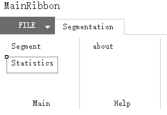
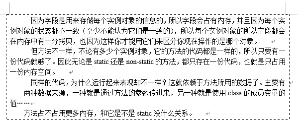
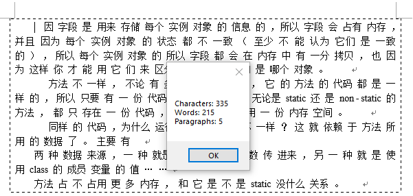

# WordAddin for Segmentation
This project is a demo for word-addin on Chinese word segmentation.

You can download [here](https://github.com/BeNhNp/WordAddin_Segmentation/releases) and try on your own machine.

## Introduction

The interface

open a documet like the following:

we can first segment all the paragraph, the show the statistics data:

## TODO

1. It use a commential binary package for word segmentation, I'll alternate it to other free libraries these days(not available at hand).

2. It is very a toy now, rather simple and rough, I'll make it suit for real work later.
